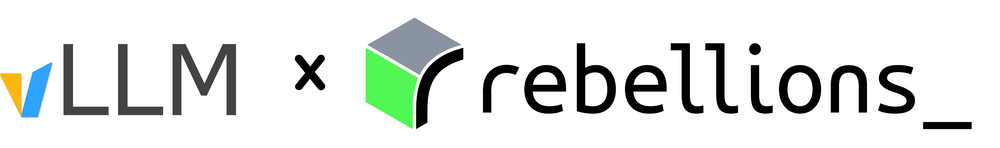

# vLLM RBLN Plugin
<div align="center">
<picture>
  <source srcset="assets/vllm-rbln-white.png" media="(prefers-color-scheme: dark)">
  <source srcset="assets/vllm-rbln-black.png" media="(prefers-color-scheme: light)">
  
</picture>

[](https://badge.fury.io/py/vllm-rbln)
[](https://github.com/rebellions-sw/vllm-rbln/blob/dev/LICENSE)
[](https://docs.rbln.ai/software/model_serving/vllm_support/vllm-rbln.html)
[](./CODE_OF_CONDUCT.md)
</div>

This repository provides the hardware plugin that enables vLLM on RBLN NPUs, including [ATOM](https://rebellions.ai/rebellions-product/rbln-ca25/) and [REBEL](https://rebellions.ai/rebellions-product/rebel-quad/).

Built on top of [vLLM’s Plugin System](https://docs.vllm.ai/en/latest/design/plugin_system.html), it allows seamless integration with the vLLM ecosystem and provides high-throughput, low-latency LLM serving on RBLN hardware. Our plugin supports a wide range of popular LLMs and continues to expand to support all features enabled in vLLM, including advanced attention mechanisms.

## 🚀 Getting Started

### 📋 Prerequisites

- `rebel-compiler`
- `optimum-rbln`

### ⚙️ Installation

You can install this project using `pip` or from source.

#### Install via PyPI

```bash
pip install vllm-rbln
```

#### Or from source

```bash
git clone https://github.com/rebellions-sw/vllm-rbln.git
cd vllm-rbln
pip install -e .
```

### 📚 Documentation

- [Overview & Supported Models](https://docs.rbln.ai/software/model_serving/vllm_support/vllm-rbln.html)
- [API Tutorial](https://docs.rbln.ai/software/model_serving/vllm_support/tutorial/vllm_llama3-8b.html)


## 🤝 Contributing

We welcome all contributions! Whether it's reporting issues, proposing enhancements, or improving docs—your input helps make the project better.

See our [CONTRIBUTING.md](./CONTRIBUTING.md) for more information.

## 📄 License

This project is licensed under the Apache License 2.0.

See the [LICENSE](./LICENSE) file for more information.

## 📧 Contact

- Join discussions and get answers in our [Developer Community](https://discuss.rebellions.ai/)
- Contact maintainers at [support@rebellions.ai](mailto:support@rebellions.ai)
